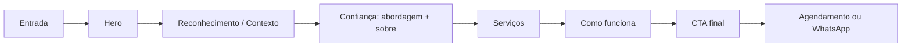

# Design Document — Hotsite Janaína Hollanda

## Document control

| Campo | Valor |
|---|---|
| **Título** | Hotsite de conversão — Janaína Hollanda |
| **Status** | `ready-for-review` |
| **Owner** | `[OPEN]` |
| **Data** | 2026-07-10 (rev. 2026-07-11 — segurança HTTP) |
| **Idioma** | Português (Brasil) |
| **Fontes relacionadas** | `docs/inputs/*`, `AGENTS.md`, `.cursor/rules/*` |
| **Addenda** | `docs/designs/2026-07-11-http-security-headers-design.md` |

### Inventário de fontes

| Fonte | Caminho | Papel |
|---|---|---|
| Project brief | `docs/inputs/project-brief.md` | Objetivo, conversão, restrições |
| Brand guidelines | `docs/inputs/brand-guidelines.md` | Paleta, tipografia, fotografia, voz |
| Content inventory | `docs/inputs/content-inventory.md` | Copy e seções da homepage |
| Audience and offer | `docs/inputs/audience-and-offer.md` | Público, objeções, oferta |
| Business requirements | `docs/inputs/business-requirements.md` | Requisitos funcionais e de experiência |
| Technical constraints | `docs/inputs/technical-constraints.md` | Princípios técnicos e performance |
| Analytics and conversion | `docs/inputs/analytics-and-conversion.md` | Eventos e funil |
| Legal and compliance | `docs/inputs/legal-and-compliance.md` | Privacidade, claims, disclaimers |
| Research | `docs/inputs/research.md` | Evidência disponível |
| Repositório | Inspeção em 2026-07-10 | Framework de skills; sem stack de aplicação aprovada |

### Tabela de status de inputs

| Input | Encontrado | Status | Conflitos | Ação |
|---|---|---|---|---|
| Project brief | Sim | `usable` | Nenhum | Usar como base de objetivo e conversão |
| Brand guidelines | Sim | `usable` | Nenhum | Aplicar tokens e direção visual |
| Content inventory | Sim | `partial` | Nenhum | Usar copy fornecida; marcar `needs-review` |
| Audience and offer | Sim | `partial` | Nenhum | Tratar segmentação como `[ASSUMPTION]` |
| Business requirements | Sim | `usable` | Nenhum | Traduzir em requisitos com IDs |
| Technical constraints | Sim | `partial` | Nenhum | Stack ainda `[OPEN]` |
| Analytics and conversion | Sim | `partial` | Nenhum | Plataforma `[OPEN]` |
| Legal and compliance | Sim | `partial` | Nenhum | Checklist; não é aconselhamento legal |
| Research | Sim | `partial` | Nenhum | Sem dados quantitativos |
| Código existente | Não | `missing` | Nenhum | Arquitetura proposta como `[RECOMMENDATION]` |
| Logo e assets visuais | Não | `missing` | Nenhum | Placeholders até aprovação |
| Destinos de CTA | Não | `missing` | Nenhum | Bloqueador de aprovação |
| Credenciais verificadas | Não | `requires-verification` | Nenhum | Bloqueador de aprovação |
| Políticas legais | Não | `missing` | Nenhum | Footer e formulários bloqueados |

---

## 1. Executive summary

Este documento define a **estrutura geral** de um hotsite de página única para a prática terapêutica de Janaína Hollanda. O site deve transmitir discrição, profundidade e credibilidade profissional por meio de uma narrativa calma, tipografia editorial e paleta natural — sem linguagem de vendas agressiva nem estímulos visuais excessivos.

A conversão primária é **iniciar uma conversa inicial** (`Agendar uma conversa`). A jornada prioriza construção de confiança antes do pedido de ação, adequada a visitantes conscientes do problema mas ainda hesitantes em agendar.

O repositório atual contém o framework de entrega (skills, inputs, regras) mas **não possui stack de aplicação aprovada nem código de produção**. A arquitetura técnica proposta abaixo é `[RECOMMENDATION]` sujeita a aprovação.

**Bloqueadores para aprovação final:** destino do CTA primário, verificação de credenciais, políticas de privacidade/cookies, número/link do WhatsApp, e definição do canal de agendamento.

---

## 2. Business objective and success metrics

### Objetivo de negócio

Encorajar visitantes qualificados a iniciar uma conversa privada sobre suporte terapêutico, após compreenderem a abordagem, os serviços e o processo.

### Conversão primária

- **CTA:** `Agendar uma conversa`
- **Destino:** `[OPEN: URL de agendamento, formulário, WhatsApp ou calendário]`

### Conversões secundárias

| CTA | Função |
|---|---|
| `Conhecer os atendimentos` | Exploração de serviços |
| `Conhecer minha abordagem` | Aprofundamento metodológico |
| `Conhecer minha trajetória` | Credibilidade profissional |
| `Conhecer o atendimento individual` | Detalhe do serviço 1 |
| `Conhecer a Constelação Familiar` | Detalhe do serviço 2 |
| `Conhecer as próximas vivências` | Detalhe do serviço 3 |
| `Entrar em contato pelo WhatsApp` | Canal alternativo de contato |

### Métricas de sucesso

| Métrica | Fonte | Status |
|---|---|---|
| CTR do CTA primário | `project-brief.md` | Meta numérica `[OPEN]` |
| Inícios de conversa qualificada | `project-brief.md` | `[OPEN]` |
| Inícios de contato WhatsApp | `project-brief.md` | `[OPEN]` |
| Taxa de conclusão de agendamento | `project-brief.md` | `[OPEN]` |
| Engajamento com seções de serviço/abordagem | `project-brief.md` | `[OPEN]` |
| Taxa de conversão mobile | `project-brief.md` | `[OPEN]` |

---

## 3. Audience and awareness level

### Público primário `[ASSUMPTION derivada do copy]`

Adultos que:

- sentem sobrecarga emocional, ansiedade, tristeza ou desconexão;
- repetem padrões em relacionamentos ou decisões;
- enfrentam luto, transição ou escolhas importantes;
- buscam autoconhecimento, maturidade emocional ou sentido;
- preferem abordagem individualizada, reflexiva e discreta.

Dados demográficos, geográficos e de canal permanecem `[OPEN]`.

### Nível de consciência

Visitantes **conscientes do problema**, considerando suporte, possivelmente comparando abordagens — **não necessariamente prontos para agendar imediatamente**.

### Perguntas do visitante (ordem de prioridade na narrativa)

1. Este espaço é adequado ao que estou vivendo?
2. Serei acolhido(a) sem julgamento?
3. Que tipo de trabalho é oferecido?
4. Quem é Janaína e qual sua formação?
5. Como começa o processo?
6. O atendimento é presencial ou on-line?
7. Quão privado e confidencial é o processo?
8. O que fazer quando preciso de cuidado médico ou regulado?

---

## 4. Problem, offer, positioning, and value proposition

### Problema reconhecido

Muitas pessoas aprendem a "dar conta de tudo" enquanto carregam ansiedade, cansaço emocional e padrões repetitivos — sem espaço para desacelerar e compreender a própria história.

### Posicionamento

Espaço terapêutico reservado que integra múltiplas perspectivas (neurociência, TCC, logoterapia, terapia transpessoal, abordagem sistêmica) para acompanhamento individualizado.

### Proposta de valor

> Um espaço de acolhimento, discrição, profundidade e desenvolvimento pessoal consciente.

### Promessa de marca

> Silêncio, elegância e profundidade.

### Percepção desejada

Confiável, madura, acolhedora, sofisticada, calma, profunda, humana, discreta.

### Oferta primária

Conversa inicial privada para compreender o momento do visitante, explicar o acompanhamento e avaliar o caminho mais adequado.

### Ofertas de serviço

1. Atendimento individual (presencial ou on-line)
2. Constelação Familiar
3. Vivências e workshops em grupo

Disponibilidade geográfica, preços e calendário de workshops: `[OPEN]`.

---

## 5. Conversion strategy

### Princípios

- Expor `Agendar uma conversa` como ação primária no hero, em "Como funciona" e no CTA final.
- Oferecer exploração de serviços como caminho secundário sem pressão.
- Repetir CTA final com WhatsApp como alternativa de menor comprometimento.
- Evitar pop-ups, contagem regressiva, urgência artificial e captura agressiva.
- Manter ritmo calmo: no máximo **três** instâncias visíveis do CTA primário na página (hero, meio, final).

### Funil proposto



### Mapeamento CTA → destino

| CTA | Destino proposto | Status |
|---|---|---|
| `Agendar uma conversa` | URL/formulário/calendário configurável | `[OPEN]` |
| `Agendar uma conversa inicial` | Mesmo destino do CTA primário | `[OPEN]` |
| `Conhecer os atendimentos` | Âncora `#atendimentos` | Proposto |
| `Conhecer minha abordagem` | Âncora `#abordagem` | Proposto |
| `Conhecer minha trajetória` | Âncora `#sobre` | Proposto |
| `Conhecer o atendimento individual` | Âncora `#atendimento-individual` | Proposto |
| `Conhecer a Constelação Familiar` | Âncora `#constelacao-familiar` | Proposto |
| `Conhecer as próximas vivências` | `[OPEN: âncora ou link externo]` | `[OPEN]` |
| `Entrar em contato pelo WhatsApp` | Link `wa.me` configurável | `[OPEN]` |

---

## 6. Goals, non-goals, assumptions, and constraints

### Goals

- Publicar homepage de página única com narrativa completa de conversão.
- Comunicar posicionamento, abordagem, trajetória, serviços e processo.
- Garantir experiência mobile-first, acessível e performática.
- Manter destinos de CTA configuráveis (não hard-coded).
- Preservar linguagem de cuidado integrado sem substituir assistência indicada.

### Non-goals

- Depoimentos/testemunhos (não aprovados).
- Página de preços (política `[OPEN]`).
- FAQ com respostas inventadas.
- Blog ou CMS editorial complexo na v1.
- Suporte multilíngue.
- Campanhas de mídia paga (pode ser `[OPEN]`).
- Serviço de emergência ou crise.

### Assumptions

- `[ASSUMPTION]` Página única com navegação por âncoras atende à v1.
- `[ASSUMPTION]` Visitantes chegam principalmente por busca orgânica, indicação ou redes sociais.
- `[ASSUMPTION]` Cormorant Garamond + Lato/Source Sans 3 são aceitáveis até confirmação de licença Canela/Avenir.
- `[ASSUMPTION]` Vivências podem ser link externo ou seção editorial sem calendário dinâmico na v1.

### Constraints

- Evitar estética clínica, fria ou hospitalar.
- Evitar claims de cura, garantia ou urgência.
- Evitar stock photography excessivamente produzida.
- Evitar retratos sorrindo diretamente para câmera.
- Validar contraste WCAG AA em todas as combinações de cor.
- Não coletar dados sensíveis de saúde em formulário de marketing sem revisão legal.

---

## 7. Information architecture and page narrative

### Tipo de site

**Hotsite de página única** (`/`) com navegação por âncoras internas. Páginas legais separadas quando aprovadas (`/privacidade`, `/cookies`).

### Mapa de seções (ordem narrativa)

| Ordem | ID | Título | Papel na jornada |
|---:|---|---|---|
| 0 | `header` | Cabeçalho e navegação | Orientação e acesso rápido |
| 1 | `hero` | Hero | Promessa e CTA primário |
| 2 | `contexto` | Apresentação / contexto | Reconhecimento emocional |
| 3 | `como-posso-ajudar` | Um olhar para além do sintoma | Adequação ao visitante |
| 4 | `abordagem` | Conhecimento, escuta e profundidade | Método e credibilidade |
| 5 | `sobre` | Trajetória de Janaína | Confiança pessoal |
| 6 | `atendimentos` | Caminhos diferentes para momentos distintos | Oferta de serviços |
| 7 | `transicao` | Declaração de transição | Pausa emocional / reframe |
| 8 | `como-funciona` | Como funciona | Redução de fricção |
| 9 | `cta-final` | CTA final | Conversão |
| 10 | `footer` | Rodapé e informações legais | Identidade, contato, legal |

### Seções avaliadas e excluídas

| Seção (framework) | Decisão | Motivo |
|---|---|---|
| FAQ | Excluída na v1 | Sem conteúdo aprovado; respostas inventadas proibidas |
| Depoimentos | Excluída | Não aprovado legal/eticamente |
| Preços | Excluída | Política `[OPEN]` |
| Blog | Excluída | Fora do escopo |

### Navegação do header

| Label | Destino | Visibilidade |
|---|---|---|
| Início | `#hero` ou topo | Desktop e mobile |
| Atendimentos | `#atendimentos` | Desktop e mobile |
| Abordagem | `#abordagem` | Desktop e mobile |
| Sobre | `#sobre` | Desktop e mobile |
| Como funciona | `#como-funciona` | Desktop e mobile |
| Agendar conversa | Destino primário `[OPEN]` | Botão destacado; sempre visível |

**Mobile:** menu compacto (drawer ou menu expansível) com os mesmos itens; CTA primário permanece acessível sem abrir menu.

---

## 8. Section contracts

### SEC-header — Cabeçalho e navegação

| Campo | Definição |
|---|---|
| **Purpose** | Orientar o visitante e permitir acesso direto às seções e à conversão |
| **Visitor question** | Onde estou e como navegar? |
| **Required message** | Identidade discreta da marca; navegação clara |
| **Source content** | `[OPEN]` logo; labels derivados de `business-requirements.md` |
| **Evidence** | Logo e identidade visual `[OPEN]` |
| **Primary CTA** | `Agendar uma conversa` |
| **Secondary CTA** | Links de navegação |
| **Desktop** | Header fixo ou sticky com fundo `color-background-primary` ou translúcido; logo à esquerda; nav central/direita; botão CTA à direita |
| **Mobile** | Logo + botão menu + CTA compacto ou ícone; drawer com foco preso e fechamento por Esc |
| **A11y** | `<header>`, `<nav aria-label="Principal">`, skip link para `#main`, foco visível em todos os controles |
| **Analytics** | `cta_click` (`cta_location: header`), `nav_click` |
| **Content owner** | `[OPEN]` |

---

### SEC-hero — Hero

| Campo | Definição |
|---|---|
| **Purpose** | Comunicar proposta de valor e iniciar conversão ou exploração |
| **Visitor question** | Este espaço é para mim? |
| **Required message** | Cuidado consciente da mente em ambiente reservado e acolhedor |
| **Source content** | `content-inventory.md` — Hero |
| **Evidence** | Copy fornecida (`provided`) |
| **Primary CTA** | `Agendar uma conversa` |
| **Secondary CTA** | `Conhecer os atendimentos` → `#atendimentos` |
| **Desktop** | Headline serifada grande; copy de apoio com largura máxima ~65ch; CTAs lado a lado; imagem ambiental opcional à direita ou fundo sutil |
| **Mobile** | Stack vertical; headline com `text-wrap: balance`; CTAs full-width ou empilhados; sem imagem pesada above-the-fold se prejudicar LCP |
| **A11y** | `<h1>` único na página; imagem decorativa com `alt=""` ou descritiva se informativa |
| **Analytics** | `cta_click` (`cta_location: hero`), `section_view` (`section_id: hero`) |
| **Content owner** | Cliente |

**Headline:** *Cuidar da mente também é aprender a olhar para si com mais consciência.*

---

### SEC-contexto — Apresentação / contexto

| Campo | Definição |
|---|---|
| **Purpose** | Gerar reconhecimento emocional e introduzir o valor do processo terapêutico |
| **Visitor question** | Por que desacelerar agora? |
| **Required message** | Não é só seguir em frente; é compreender padrões e construir recursos internos |
| **Source content** | `content-inventory.md` — Presentation |
| **Evidence** | Copy fornecida |
| **Primary CTA** | Nenhum (ritmo de leitura) |
| **Secondary CTA** | Link textual opcional para `#como-funciona` |
| **Desktop** | Bloco editorial com whitespace generoso; possível pull-quote da abertura |
| **Mobile** | Parágrafos curtos; espaçamento vertical amplo |
| **A11y** | `<section>` com heading `<h2>`; contraste AA |
| **Analytics** | `section_view` (`section_id: contexto`) |
| **Content owner** | Cliente |

---

### SEC-como-posso-ajudar — Um olhar para além do sintoma

| Campo | Definição |
|---|---|
| **Purpose** | Ajudar o visitante a ver adequação entre sua experiência e o acompanhamento |
| **Visitor question** | Isso se aplica ao que estou vivendo? |
| **Required message** | Acompanhamento individualizado além do sintoma |
| **Source content** | `content-inventory.md` — How I can help |
| **Evidence** | Lista de tópicos `needs-review`; disclaimer de cuidado integrado `needs-review` |
| **Primary CTA** | Nenhum |
| **Secondary CTA** | Scroll para `#atendimentos` após lista |
| **Desktop** | Intro + lista em coluna ou grid de 2 colunas com marcadores discretos |
| **Mobile** | Lista única coluna; itens com respiro |
| **A11y** | Lista semântica `<ul>`; linguagem de saúde sem alarmismo |
| **Analytics** | `section_view` (`section_id: como-posso-ajudar`) |
| **Content owner** | Cliente + revisão profissional/legal |

**Nota:** Publicar somente após revisão de terminologia clínica e escopo profissional.

---

### SEC-abordagem — Conhecimento, escuta e profundidade

| Campo | Definição |
|---|---|
| **Purpose** | Explicar integração metodológica e profundidade do trabalho |
| **Visitor question** | Como é conduzido o trabalho? |
| **Required message** | Caminho personalizado integrando múltiplas perspectivas |
| **Source content** | `content-inventory.md` — Approach |
| **Evidence** | Métodos mencionados `needs-review` |
| **Primary CTA** | Nenhum |
| **Secondary CTA** | `Conhecer minha abordagem` → permanece na seção ou expande painel `[RECOMMENDATION: scroll suave]` |
| **Desktop** | Texto longo com subtítulos para cada perspectiva; detalhe dourado (`color-accent-gold`) em separadores |
| **Mobile** | Accordion opcional apenas se densidade prejudicar leitura — preferir texto contínuo na v1 |
| **A11y** | Hierarquia `h2` > `h3`; sem animação obrigatória |
| **Analytics** | `section_view`, `cta_click` (`cta_location: abordagem`) |
| **Content owner** | Cliente + revisão profissional |

---

### SEC-sobre — Trajetória de Janaína Hollanda

| Campo | Definição |
|---|---|
| **Purpose** | Estabelecer credibilidade humana e profissional |
| **Visitor question** | Quem é Janaína e por que confiar? |
| **Required message** | Trajetória dedicada ao estudo da mente com propósito de espaço seguro |
| **Source content** | `content-inventory.md` — About |
| **Evidence** | Credenciais `needs-review` — **bloqueador** |
| **Primary CTA** | Nenhum |
| **Secondary CTA** | `Conhecer minha trajetória` |
| **Desktop** | Layout editorial: texto + retrato ambiental (quando disponível); evitar pose direta à câmera |
| **Mobile** | Retrato acima ou abaixo do texto; proporção consistente |
| **A11y** | `alt` descritivo em retrato aprovado |
| **Analytics** | `section_view` (`section_id: sobre`), `cta_click` |
| **Content owner** | Cliente |

**Bloqueador:** verificar pós-graduações, institutos e uso do termo `terapêutico` antes de publicação.

---

### SEC-atendimentos — Caminhos diferentes para momentos distintos

| Campo | Definição |
|---|---|
| **Purpose** | Apresentar as três modalidades de serviço |
| **Visitor question** | Que formatos de atendimento existem? |
| **Required message** | Individual, Constelação Familiar e Vivências atendem momentos distintos |
| **Source content** | `content-inventory.md` — Service modalities |
| **Evidence** | Descrições `needs-review`; disponibilidade `[OPEN]` |
| **Primary CTA** | Nenhum por card |
| **Secondary CTA** | Um por card: `Conhecer o atendimento individual`, `Conhecer a Constelação Familiar`, `Conhecer as próximas vivências` |
| **Desktop** | Três cards em `color-surface-warm`; grid 3 colunas ou 1+2 |
| **Mobile** | Cards empilhados; touch targets ≥ 44px |
| **A11y** | Cada card como `<article>` com heading `h3`; links com texto descritivo |
| **Analytics** | `service_view`, `cta_click` por serviço |
| **Content owner** | Cliente |

#### Sub-seções (âncoras)

| ID âncora | Serviço |
|---|---|
| `#atendimento-individual` | Atendimento individual |
| `#constelacao-familiar` | Constelação Familiar |
| `#vivencias` | Vivências e workshops |

---

### SEC-transicao — Declaração de transição

| Campo | Definição |
|---|---|
| **Purpose** | Pausa narrativa; reframe emocional antes do processo prático |
| **Visitor question** | — (momento reflexivo) |
| **Required message** | *Nem tudo o que você carrega começou em você. Mas pode ser a partir de você que uma nova história comece.* |
| **Source content** | `content-inventory.md` — Transition |
| **Evidence** | Fornecido; revisão editorial recomendada |
| **Primary CTA** | Nenhum |
| **Secondary CTA** | Nenhum |
| **Desktop** | Bloco centralizado, tipografia serifada maior, fundo alternado sutil |
| **Mobile** | Mesmo tratamento; padding generoso |
| **A11y** | Pode usar `<blockquote>` se semanticamente adequado |
| **Analytics** | `section_view` (`section_id: transicao`) |
| **Content owner** | Cliente |

---

### SEC-como-funciona — Como funciona

| Campo | Definição |
|---|---|
| **Purpose** | Reduzir incerteza sobre primeiro passo, modalidades e confidencialidade |
| **Visitor question** | Como começo e o que esperar? |
| **Required message** | Conversa inicial → processo individualizado → presencial ou on-line → discrição e cuidado integrado |
| **Source content** | `content-inventory.md` — How it works |
| **Evidence** | Processo `needs-review` |
| **Primary CTA** | `Agendar uma conversa inicial` |
| **Secondary CTA** | Nenhum |
| **Desktop** | Passos numerados ou lista sequencial; CTA após bloco |
| **Mobile** | Passos verticais; CTA full-width |
| **A11y** | Lista ordenada `<ol>` para passos |
| **Analytics** | `cta_click` (`cta_location: como-funciona`), `booking_start` |
| **Content owner** | Cliente |

---

### SEC-cta-final — CTA final

| Campo | Definição |
|---|---|
| **Purpose** | Converter visitantes que completaram a leitura |
| **Visitor question** | Qual é o próximo passo concreto? |
| **Required message** | Não é preciso ter todas as respostas para começar |
| **Source content** | `content-inventory.md` — Final CTA |
| **Evidence** | Fornecido |
| **Primary CTA** | `Agendar uma conversa` |
| **Secondary CTA** | `Entrar em contato pelo WhatsApp` |
| **Desktop** | Bloco de destaque com fundo `color-surface-warm` ou `color-brand-primary` invertido; dois botões |
| **Mobile** | Botões empilhados; WhatsApp como ação secundária visual |
| **A11y** | Contraste verificado em ambos os botões |
| **Analytics** | `cta_click`, `whatsapp_start`, `booking_start` |
| **Content owner** | Cliente |

---

### SEC-footer — Rodapé e informações legais

| Campo | Definição |
|---|---|
| **Purpose** | Identificação profissional, contato, links legais |
| **Visitor question** | Quem é responsável e como entrar em contato? |
| **Required message** | Identidade, contato, avisos legais |
| **Source content** | `[OPEN]` — parcialmente em `legal-and-compliance.md` |
| **Evidence** | Contato, registro profissional, políticas `[OPEN]` |
| **Primary CTA** | Repetição discreta de agendamento |
| **Secondary CTA** | Links: Privacidade, Cookies (quando aplicável), WhatsApp |
| **Desktop** | Colunas: identidade, navegação, legal, contato |
| **Mobile** | Stack; links legais acessíveis |
| **A11y** | `<footer>`; informação de contato em texto, não só ícone |
| **Analytics** | `cta_click` (`cta_location: footer`) |
| **Content owner** | Cliente + assessoria legal |

**Conteúdo mínimo exigido antes de publicação:**

- Nome profissional e titulação verificada
- Contato (e-mail e/ou telefone/WhatsApp)
- Link para política de privacidade
- Aviso de não substituição de cuidado indicado (resumo)
- `[OPEN]` endereço ou região de atendimento presencial

---

## 9. User journeys and interaction model

### Jornada A — Conversão direta

1. Chega ao hero via busca ou indicação.
2. Lê headline e copy de apoio.
3. Clica `Agendar uma conversa`.
4. Entra no fluxo externo de agendamento `[OPEN]`.

### Jornada B — Exploração → conversão

1. Chega ao hero.
2. Clica `Conhecer os atendimentos`.
3. Lê cards de serviço e seção "Como posso ajudar".
4. Revisa abordagem e sobre.
5. Lê "Como funciona".
6. Converte no CTA final.

### Jornada C — WhatsApp

1. Percorre a página.
2. Prefere contato informal.
3. Clica `Entrar em contato pelo WhatsApp` no CTA final (ou footer).

### Modelo de interação

| Interação | Comportamento |
|---|---|
| Navegação por âncora | Scroll suave; `scroll-margin-top` compensa header sticky |
| Menu mobile | Abre/fecha com trap de foco; `aria-expanded` |
| CTAs externos | Abrem em nova aba apenas se destino for externo e intencional |
| Formulário (se aprovado) | Validação inline; consentimento explícito; sem campos de saúde sensível |
| Reduced motion | Desativa scroll suave e transições decorativas |
| Hover/focus | Estados derivados da paleta aprovada |

---

## 10. Content inventory and missing assets

### Copy fornecida (status)

| Seção | Status |
|---|---|
| Hero | `provided` |
| Apresentação | `provided` |
| Como posso ajudar | `provided` / `needs-review` |
| Abordagem | `provided` / `needs-review` |
| Sobre | `provided` / `needs-review` |
| Atendimentos | `provided` / `needs-review` |
| Transição | `provided` |
| Como funciona | `provided` / `needs-review` |
| CTA final | `provided` |
| Header | `missing` |
| Footer/legal | `missing` |

### Assets ausentes

| Asset | Prioridade | Bloqueador |
|---|---|---|
| Logo | Alta | Não (placeholder tipográfico possível) |
| Retrato profissional aprovado | Média | Não |
| Fotografia ambiental | Média | Não |
| Favicon | Média | Não para draft |
| Imagem OG/social | Média | Sim para lançamento |
| Política de privacidade | Alta | **Sim** |
| Política de cookies | Condicional | Sim se tracking |
| Número/link WhatsApp | Alta | **Sim** |
| URL de agendamento | Alta | **Sim** |

---

## 11. Visual direction and design tokens

### Direção visual

Identidade quieta, refinada e natural. Whitespace generoso, texturas suaves, luz natural. Profundidade via tipografia serifada e paleta terrosa — sem excesso decorativo.

Alinhado a `web-design-guidelines`: foco visível, sem `transition: all`, `prefers-reduced-motion`, imagens com dimensões explícitas, headings com `text-wrap: balance`.

### Tokens de cor (de `brand-guidelines.md`)

| Token | HEX | Uso |
|---|---|---|
| `color-brand-primary` | `#3E4A36` | Títulos, botões primários, links |
| `color-background-primary` | `#F8F5EF` | Fundo da página |
| `color-surface-warm` | `#E9E1D5` | Cards, blocos destacados |
| `color-accent-gold` | `#C8A46A` | Detalhes, ícones, regras |
| `color-accent-sage` | `#A6B29B` | Detalhes decorativos |
| `color-text-primary` | `#4D4D4D` | Corpo |
| `color-text-muted` | `#B9B3A7` | Auxiliar (validar contraste) |
| `color-accent-petrol` | `#4B6A72` | Uso raro e deliberado |

### Estados interativos `[RECOMMENDATION]`

| Estado | Tratamento |
|---|---|
| Hover (botão primário) | Escurecer ~8% o verde oliva |
| Focus | Anel visível `color-accent-gold` ou outline 2px |
| Active | Escurecer ~12% |
| Disabled | Opacidade 50%; sem pointer |
| Visited (link) | Manter legibilidade; sublinhado opcional |

### Tipografia

| Papel | Fonte preferida | Fallback `[RECOMMENDATION]` |
|---|---|---|
| Headings | Cormorant Garamond | Cormorant Garamond (Google Fonts) |
| Body / UI | Lato ou Source Sans 3 | Source Sans 3 (Google Fonts) |
| Alternativa premium | Canela / Avenir | Somente com licença confirmada |

**Escala tipográfica sugerida:**

| Elemento | Desktop | Mobile |
|---|---|---|
| `h1` | 2.5–3rem | 2–2.25rem |
| `h2` | 2–2.25rem | 1.75–2rem |
| `h3` | 1.5rem | 1.25–1.5rem |
| Body | 1.125rem / lh 1.7 | 1rem / lh 1.65 |
| Small | 0.875rem | 0.875rem |

### Fotografia

Preferir: luz de janela, oliveira, pedras, têxteis naturais, cerâmica, caminhos, água, livros, mãos, natureza, interiores claros.

Evitar: stock comercial, sorrisos exagerados, pose para câmera, ambientes clínicos, imagens místicas escuras.

### Motion

- Transições lentas (200–400ms) em `opacity` e `transform` apenas.
- Scroll suave opcional; desativado com `prefers-reduced-motion`.
- Sem parallax, bounce ou flash.

### Espaçamento `[RECOMMENDATION]`

| Token | Valor |
|---|---|
| `space-section-y` | 5rem desktop / 3.5rem mobile |
| `space-block` | 1.5–2rem |
| `container-max` | 72rem (1152px) |
| `content-max` | 65ch para prosa |

---

## 12. Component inventory and states

| Componente | Variantes | Estados |
|---|---|---|
| `SiteHeader` | default, scrolled | sticky, menu-open (mobile) |
| `SkipLink` | — | focus-visible |
| `PrimaryButton` | default | default, hover, focus, active, disabled, loading |
| `SecondaryButton` | outline, ghost | idem |
| `NavLink` | inline, mobile-drawer | default, hover, focus, active (âncora atual) |
| `Section` | default, warm-surface, emphasis | — |
| `Prose` | long-form | — |
| `TopicList` | bullet | — |
| `ServiceCard` | 3 serviços | default, hover (sutil) |
| `PullQuote` | transição | — |
| `ProcessSteps` | ordered list | — |
| `CtaBlock` | hero, mid, final | — |
| `SiteFooter` | — | — |
| `WhatsAppLink` | button, text | — |
| `CookieConsent` | `[OPEN]` | hidden, visible, accepted, rejected |

Todos os componentes devem aceitar destinos e copy via configuração central, não hard-coded.

---

## 13. Technical architecture

### Estado do repositório

O repositório contém aplicação **Astro estática** (`astro.config.mjs`, `output: 'static'`), componentes em `src/`, deploy via GitHub Actions para VPS (`.github/workflows/deploy.yml`). Cabeçalhos HTTP de segurança **não estão configurados** no repositório — ver addendum `docs/designs/2026-07-11-http-security-headers-design.md`.

### DEC-001 — Arquitetura de página única

- **Status:** Proposed
- **Decisão:** Homepage estática/SSR em rota `/` com âncoras; páginas legais separadas quando existirem.
- **Alternativas:** Multi-page por serviço; SPA com rotas — rejeitadas na v1 por complexidade desnecessária dado o inventário de conteúdo.
- **Consequência:** SEO concentrado em uma URL; implementação mais simples.

### DEC-002 — Stack tecnológica

- **Status:** Implemented (SPEC-001)
- **Decisão:** **Astro** com geração estática, TypeScript, CSS com tokens em `src/styles/`.
- **Rationale:** SSG alinhado a `technical-constraints.md`; baixo JS; deploy SCP para VPS.
- **Validação:** `npm run build` e pipeline CI passam.

### DEC-003 — Tipografia web

- **Status:** Proposed
- **Decisão:** Cormorant Garamond + Source Sans 3 via Google Fonts com `font-display: swap` até confirmação de Canela/Avenir.
- **Consequência:** Sem dependência de licença proprietária na v1.

### DEC-004 — Conteúdo e configuração

- **Status:** Proposed
- **Decisão:** Copy em arquivos de conteúdo (JSON/MD) ou CMS headless `[OPEN]`; destinos de CTA em arquivo de configuração único (`site.config.ts` ou similar).
- **Consequência:** Alterar WhatsApp/agendamento sem tocar componentes.

### Estrutura de diretórios proposta `[RECOMMENDATION]`

```text
src/
  components/     # Componentes de seção
  content/          # Copy aprovada por seção
  config/           # CTAs, contato, metadata
  styles/           # Tokens e globals
  pages/ ou app/     # Rotas
public/
  images/           # Assets otimizados
docs/
  designs/          # Este documento
  specs/            # Specs de implementação
```

### CMS / propriedade de conteúdo

| Opção | Prós | Contras |
|---|---|---|
| Arquivos no repositório | Simples, versionado | Edição técnica |
| CMS headless (Sanity, etc.) | Edição não técnica | Custo e complexidade |
| Híbrido | Copy em arquivos; CTAs em config | — |

**Decisão:** `[OPEN]` — `[RECOMMENDATION]` arquivos no repositório para v1.

---

## 14. Forms and integrations

### Canal primário `[OPEN]`

Opções a avaliar com o cliente:

| Opção | Prós | Contras |
|---|---|---|
| Calendly / similar | Agendamento estruturado | Terceiro, custo, LGPD |
| WhatsApp como primário | Baixa fricção no BR | Menos estruturado |
| Formulário próprio | Controle total | Backend, spam, LGPD |
| Link para plataforma existente | Reuso | Dependência externa |

### WhatsApp

- **Requisito:** obrigatório como conversão secundária.
- **Implementação:** link `https://wa.me/<numero>?text=<mensagem codificada>` configurável.
- **Mensagem pré-preenchida `[RECOMMENDATION]`:** *Olá, gostaria de agendar uma conversa inicial.*
- **Número:** `[OPEN]`

### Formulário de contato `[OPEN]`

Se aprovado:

| Campo | Obrigatório | Notas |
|---|---|---|
| Nome | Sim | `autocomplete="name"` |
| E-mail ou telefone | Sim | Tipo correto |
| Interesse no serviço | Opcional | Select |
| Mensagem breve | Opcional | Sem dados clínicos |
| Consentimento LGPD | Sim | Link para privacidade |

Proteção anti-spam: honeypot ou CAPTCHA leve `[RECOMMENDATION]`.

### Vivências / workshops

`[OPEN]`: seção editorial estática ou link para página externa/calendário.

---

## 15. SEO and social metadata

### Estratégia

- Página única otimizada para intenções de busca informacional e transacional suaves.
- Linguagem natural alinhada ao copy aprovado; sem keyword stuffing.

### Metadata `[OPEN — redação final após revisão]`

| Campo | Direção |
|---|---|
| `<title>` | Janaína Hollanda — Acompanhamento terapêutico e desenvolvimento pessoal |
| `<meta description>` | Baseada no parágrafo de apoio do hero (≤ 160 caracteres após edição) |
| `canonical` | URL de produção `[OPEN]` |
| `lang` | `pt-BR` |
| Open Graph | `og:title`, `og:description`, `og:image`, `og:locale` |
| Twitter Card | `summary_large_image` |

### Estrutura semântica

- Um `<h1>` no hero.
- `<h2>` por seção principal.
- JSON-LD `[RECOMMENDATION]`: `Person` + `ProfessionalService` — somente com dados verificados.

### Pesquisa SEO

Recomendada antes do lançamento (`research.md`); não executada neste documento.

---

## 16. Analytics and consent

### Plataforma

`[OPEN]` — opções: Plausible (privacidade), GA4, Matomo.

### Eventos (de `analytics-and-conversion.md`)

| Evento | Trigger |
|---|---|
| `cta_click` | Qualquer CTA |
| `booking_start` | Entrada no fluxo de agendamento |
| `booking_complete` | Confirmação via integração suportada |
| `whatsapp_start` | Clique WhatsApp |
| `service_view` | Visualização/expansão de serviço |
| `section_view` | Seção visível (Intersection Observer, se adotado) |
| `form_start` / `form_submit` / `form_error` | Se formulário existir |

### Consentimento

- Não disparar tracking não essencial antes do consentimento exigido.
- Não enviar dados sensíveis de saúde em propriedades de evento.
- Banner de cookies se pixels/analytics de terceiros exigirem — `[OPEN]` conforme jurisdição e stack.

---

## 17. Accessibility, privacy, and security

### Meta de acessibilidade

**WCAG 2.1 nível AA** para texto, contraste, navegação por teclado e estados de foco.

### Requisitos A11Y prioritários

- Skip link para conteúdo principal.
- Hierarquia de headings correta.
- Contraste AA em todas as combinações texto/fundo.
- `prefers-reduced-motion` respeitado.
- Formulários com labels, erros inline e foco no primeiro erro.
- Botões-ícone com `aria-label`.
- `touch-action: manipulation` em controles móveis.

### Privacidade

- Inventário de dados pessoais conforme fluxo aprovado (`legal-and-compliance.md`).
- Política de privacidade obrigatória antes de coleta.
- Base legal e retenção: `[OPEN]`.
- Canal para solicitações de acesso/exclusão: `[OPEN]`.

### Segurança

Requisitos detalhados de cabeçalhos HTTP, CSP, cookies e hardening de infraestrutura estão no addendum **`docs/designs/2026-07-11-http-security-headers-design.md`** (SEC-001–SEC-009).

Resumo obrigatório para produção:

| Controle | Objetivo |
|---|---|
| `Strict-Transport-Security` | Forçar HTTPS; reduzir downgrade |
| `Content-Security-Policy` + `frame-ancestors 'none'` | Mitigar XSS; bloquear clickjacking / framing externo |
| `X-Content-Type-Options: nosniff` | Evitar MIME sniffing |
| `Referrer-Policy` | Limitar vazamento de URL |
| `Permissions-Policy` | Desabilitar APIs do browser não usadas |
| Cookies HTTP (`Secure`, `HttpOnly`, `SameSite`) | Quando `Set-Cookie` existir |
| Remoção de cabeçalhos reveladores | Ocultar versão de servidor/framework |

Implementação recomendada: **nginx na VPS** (deploy estático via `.github/workflows/deploy.yml`), com CSP parametrizada conforme provedor de analytics (SPEC-012).

Requisitos de aplicação (mantidos):

- Sem segredos no bundle cliente.
- HTTPS obrigatório em produção.
- Formulários via POST seguro se implementados.
- Não solicitar dados clínicos detalhados em formulário de marketing.

### Limites profissionais

- Não se apresentar como serviço de emergência.
- Manter linguagem de cuidado integrado.
- `[OPEN]` orientação para situações urgentes/crise se exigido pela revisão legal.

---

## 18. Performance budgets

| Métrica | Meta (p75) | Fonte |
|---|---|---|
| LCP | ≤ 2,5s | `technical-constraints.md` |
| INP | ≤ 200ms | `technical-constraints.md` |
| CLS | ≤ 0,1 | `technical-constraints.md` |

### Táticas

- Fontes com `font-display: swap` e subset mínimo.
- Imagens WebP/AVIF com `width`/`height` explícitos.
- Lazy-load abaixo da dobra.
- JS mínimo; sem bibliotecas de animação pesadas.
- Terceiros limitados (analytics, consent).
- `preconnect` para origem de fontes/CDN.

---

## 19. Test and release strategy

### Validação local (quality gates do repositório)

- Instalação de dependências
- Formatter e lint
- Typecheck
- Testes unitários/componente (quando aplicável)
- Build de produção
- Checagem de acessibilidade (axe ou equivalente)
- Smoke responsivo (320px, 768px, 1280px)
- Lighthouse em mobile para CWV

### Testes recomendados pré-lançamento

- Revisão de copy por Janaína e assessoria profissional/legal
- Teste de usabilidade mobile com 3–5 visitantes do público-alvo `[RECOMMENDATION]`
- Verificação manual de todos os CTAs e links
- Validação de metadata e OG

### Release

- Ambientes: `[OPEN]` (staging + produção)
- Domínio e DNS: `[OPEN]`
- Rollback via redeploy da build anterior

---

## 20. Risks and mitigations

| Risco | Impacto | Mitigação |
|---|---|---|
| Credenciais não verificadas publicadas | Alto — legal/reputação | Bloquear publicação da seção Sobre até aprovação |
| Linguagem clínica inadequada | Alto | Revisão profissional da lista de tópicos |
| Destino de CTA indefinido | Alto — sem conversão | Resolver antes da implementação do header/CTAs |
| Fontes proprietárias sem licença | Médio | Usar Cormorant + Source Sans 3 |
| Tracking sem consentimento | Médio — LGPD | Consent manager + política |
| LCP alto por imagens/fontes | Médio | Budget de performance; imagem hero otimizada |
| FAQ solicitada sem conteúdo | Baixo | Excluir na v1; coletar perguntas reais do WhatsApp |

---

## 21. Decisions and open questions

### Registro de decisões

| ID | Título | Status |
|---|---|---|
| DEC-001 | Página única com âncoras | Proposed |
| DEC-002 | Stack Astro/Next.js `[RECOMMENDATION]` | Proposed |
| DEC-003 | Cormorant + Source Sans 3 | Proposed |
| DEC-004 | Conteúdo em arquivos + config central | Proposed |
| DEC-005 | Sem depoimentos na v1 | Proposed |
| DEC-006 | Sem FAQ na v1 | Proposed |

### Open questions (bloqueadores em **negrito**)

1. **Qual destino do CTA primário?** (calendário, formulário, WhatsApp)
2. **Título profissional e escopo regulado a exibir?**
3. **Credenciais e instituições verificadas para publicação?**
4. **Número/link do WhatsApp?**
5. **Endereço ou região de atendimento presencial?**
6. **Modalidades atualmente disponíveis?**
7. **Política de preços pública?**
8. **Política de privacidade e cookies?**
9. Depoimentos permitidos?
10. Plataforma de analytics?
11. Provedor de hospedagem e domínio?
12. CMS necessário?
13. Calendário de vivências — estático ou dinâmico?
14. Campanhas de mídia paga planejadas?
15. Quem responde contatos e em qual prazo?

---

## 22. Out of scope

- Depoimentos e estudos de caso
- Blog ou revista de conteúdo
- Área do cliente / login
- Pagamento online
- Chat ao vivo
- Seção de preços
- FAQ sem conteúdo aprovado
- Versão em inglês
- App mobile nativo
- Integração com CRM na v1 (a menos que aprovado)

---

## 23. Recommended spec decomposition

Implementar **uma spec por vez**, na ordem sugerida:

| Spec | Escopo | Dependências |
|---|---|---|
| **SPEC-001** | Fundação: stack, tokens, tipografia, layout base, config de site | Aprovação DEC-002 |
| **SPEC-002** | Header, skip link, navegação âncora, menu mobile | SPEC-001 |
| **SPEC-003** | Seção Hero | SPEC-001, SPEC-002 |
| **SPEC-004** | Seção Contexto / Apresentação | SPEC-001 |
| **SPEC-005** | Seção Como posso ajudar | SPEC-001; revisão de copy |
| **SPEC-006** | Seção Abordagem | SPEC-001 |
| **SPEC-007** | Seção Sobre | SPEC-001; credenciais verificadas |
| **SPEC-008** | Seção Atendimentos (3 cards) | SPEC-001 |
| **SPEC-009** | Seções Transição, Como funciona, CTA final | SPEC-001, destinos CTA |
| **SPEC-010** | Footer, identificação profissional, links legais | SPEC-001; políticas |
| **SPEC-011** | SEO, metadata, OG, favicon | SPEC-003+ |
| **SPEC-012** | Integrações: agendamento, WhatsApp, analytics, consent | Destinos definidos |
| **SPEC-013** | Cabeçalhos HTTP, CSP, nginx, verificação de segurança | SPEC-001; SPEC-012 (matriz analytics) |

Ver addendum: `docs/designs/2026-07-11-http-security-headers-design.md`.

---

## 24. Requirements index

### PROD-001 — Conversão primária visível

- **Priority:** Must
- **Type:** Functional
- **Source:** `docs/inputs/business-requirements.md`
- **Status:** Proposed

**Requirement:** A homepage deve expor `Agendar uma conversa` como ação primária no hero, em "Como funciona" e no CTA final.

**Validation:** Inspeção visual confirma três pontos de CTA primário com o label correto.

---

### PROD-002 — Destinos configuráveis

- **Priority:** Must
- **Type:** Functional
- **Source:** `docs/inputs/business-requirements.md`
- **Status:** Proposed

**Requirement:** Destinos de CTA e WhatsApp devem ser configuráveis em um único ponto, sem valores hard-coded em componentes.

**Validation:** Alterar URL em config atualiza todos os CTAs sem editar componentes.

---

### CONTENT-001 — Copy calma e reflexiva

- **Priority:** Must
- **Type:** Non-functional
- **Source:** `docs/inputs/content-inventory.md`
- **Status:** Proposed

**Requirement:** O site deve usar o copy fornecido nas seções mapeadas, preservando tom calmo e sem linguagem de urgência.

**Validation:** Revisão editorial confirma aderência ao inventário.

---

### CONTENT-002 — Cuidado integrado

- **Priority:** Must
- **Type:** Functional
- **Source:** `docs/inputs/content-inventory.md`, `legal-and-compliance.md`
- **Status:** Proposed

**Requirement:** O site deve incluir linguagem de que o acompanhamento pode integrar outros cuidados e não substitui assistência indicada.

**Validation:** Texto presente em "Como posso ajudar" e/ou "Como funciona" após revisão aprovada.

---

### UX-001 — Mobile-first

- **Priority:** Must
- **Type:** Non-functional
- **Source:** `docs/inputs/business-requirements.md`
- **Status:** Proposed

**Requirement:** Layout e interação devem ser projetados mobile-first, usáveis a partir de 320px de largura.

**Validation:** Smoke test em 320px, 390px e 768px sem perda de conteúdo.

---

### UX-002 — Navegação por seções

- **Priority:** Must
- **Type:** Functional
- **Source:** `docs/inputs/business-requirements.md`
- **Status:** Proposed

**Requirement:** O visitante deve acessar diretamente Atendimentos, Abordagem, Sobre, Como funciona e Contato/Agendar via header.

**Validation:** Cada link de nav rola para a seção correta com `scroll-margin-top` adequado.

---

### UX-003 — Sem padrões intrusivos

- **Priority:** Must
- **Type:** Non-functional
- **Source:** `docs/inputs/business-requirements.md`
- **Status:** Proposed

**Requirement:** O site não deve usar pop-ups, countdowns, autoplay de mídia ou captura agressiva de leads.

**Validation:** Inspeção confirma ausência desses padrões.

---

### VISUAL-001 — Paleta aprovada

- **Priority:** Must
- **Type:** Non-functional
- **Source:** `docs/inputs/brand-guidelines.md`
- **Status:** Proposed

**Requirement:** Cores devem usar exclusivamente tokens da paleta aprovada com estados derivados da mesma família.

**Validation:** Auditoria de CSS/tokens confirma ausência de cores ad hoc.

---

### VISUAL-002 — Contraste WCAG AA

- **Priority:** Must
- **Type:** Non-functional
- **Source:** `docs/inputs/brand-guidelines.md`
- **Status:** Proposed

**Requirement:** Combinações texto/fundo devem atingir contraste mínimo WCAG AA.

**Validation:** Relatório axe/Contrast checker sem falhas críticas.

---

### TECH-001 — Baixo JavaScript

- **Priority:** Must
- **Type:** Non-functional
- **Source:** `docs/inputs/technical-constraints.md`
- **Status:** Proposed

**Requirement:** Preferir SSG/SSR com payload JS mínimo; evitar dependências para comportamentos cobertos por primitivas da plataforma.

**Validation:** Build report mostra bundle inicial abaixo de limite acordado na SPEC-001.

---

### TECH-002 — HTML semântico

- **Priority:** Must
- **Type:** Non-functional
- **Source:** `docs/inputs/technical-constraints.md`
- **Status:** Proposed

**Requirement:** Usar elementos semânticos (`header`, `nav`, `main`, `section`, `footer`) antes de ARIA redundante.

**Validation:** Revisão de markup ou lint a11y semântico.

---

### SEO-001 — Metadata básica

- **Priority:** Must
- **Type:** Functional
- **Source:** DEC deste documento
- **Status:** Proposed

**Requirement:** A página deve incluir `title`, `meta description`, `canonical`, `lang="pt-BR"` e tags Open Graph.

**Validation:** Inspeção do HTML gerado confirma presença dos campos.

---

### ANALYTICS-001 — Eventos de CTA

- **Priority:** Should
- **Type:** Functional
- **Source:** `docs/inputs/analytics-and-conversion.md`
- **Status:** Proposed

**Requirement:** Cliques em CTAs devem emitir evento `cta_click` com `cta_label`, `cta_location` e `destination_type`.

**Validation:** Debug do analytics confirma payload no clique de cada CTA.

---

### A11Y-001 — Skip link e foco visível

- **Priority:** Must
- **Type:** Non-functional
- **Source:** `web-design-guidelines`, `technical-constraints.md`
- **Status:** Proposed

**Requirement:** Skip link para `#main` e foco visível em todos os elementos interativos; sem `outline: none` sem substituto.

**Validation:** Navegação exclusiva por teclado completa a jornada principal.

---

### PRIVACY-001 — Política de privacidade

- **Priority:** Must
- **Type:** Functional
- **Source:** `docs/inputs/legal-and-compliance.md`
- **Status:** Blocked

**Requirement:** Link para política de privacidade acessível no footer antes de qualquer coleta de dados pessoais.

**Validation:** Link funcional para página aprovada.

---

### PERF-001 — Core Web Vitals

- **Priority:** Must
- **Type:** Non-functional
- **Source:** `docs/inputs/technical-constraints.md`
- **Status:** Proposed

**Requirement:** LCP ≤ 2,5s, INP ≤ 200ms, CLS ≤ 0,1 no percentil 75 em mobile.

**Validation:** Lighthouse/CrUX atende metas em staging de produção.

---

### SEC-001 — Cabeçalhos HTTP de segurança

- **Priority:** Must
- **Type:** Non-functional
- **Source:** `docs/designs/2026-07-11-http-security-headers-design.md`
- **Status:** Proposed

**Requirement:** Produção deve enviar HSTS, CSP (com `frame-ancestors 'none'`), `X-Content-Type-Options: nosniff`, `Referrer-Policy` e `Permissions-Policy` conforme addendum SEC-001–SEC-006.

**Validation:** Verificação documentada pós-deploy (ex.: `curl -sI`, securityheaders.com); iframe externo bloqueado.

---

### SEC-002 — Cookies HTTP endurecidos

- **Priority:** Must (condicional)
- **Type:** Non-functional
- **Source:** `docs/designs/2026-07-11-http-security-headers-design.md`; `legal-and-compliance.md`
- **Status:** Proposed

**Requirement:** Todo cookie HTTP emitido pelo site em produção deve usar `Secure` e `SameSite`; cookies não legíveis por script devem incluir `HttpOnly`.

**Validation:** Inspeção de `Set-Cookie` quando aplicável; política de cookies atualizada.

---

### SEC-003 — Ocultar metadados de servidor

- **Priority:** Should
- **Type:** Non-functional
- **Source:** `docs/designs/2026-07-11-http-security-headers-design.md`
- **Status:** Proposed

**Requirement:** Respostas de produção não devem expor versão de servidor ou `X-Powered-By` quando controlável na infraestrutura.

**Validation:** `curl -sI` em produção conforme SEC-008 do addendum.

---

## 25. Approval checklist

### Para marcar como `approved`

- [ ] Stakeholder revisou e aprovou este documento explicitamente
- [ ] Destino do CTA primário definido e configurável
- [ ] Credenciais e titulação verificadas para publicação
- [ ] Copy de saúde/abordagem revisado profissionalmente
- [ ] WhatsApp e contato definidos
- [ ] Política de privacidade redigida e linkada
- [ ] Stack tecnológica aprovada (DEC-002)
- [ ] Decisão CMS tomada
- [ ] Plataforma de analytics e consentimento definidas
- [ ] Addendum de cabeçalhos HTTP revisado (`2026-07-11-http-security-headers-design.md`)
- [ ] Assets mínimos (logo, OG image) aprovados ou deferidos explicitamente
- [ ] Requisitos Must sem status Blocked

### Status atual

**`ready-for-review`** — documento completo para revisão do stakeholder; **não aprovado** devido aos bloqueadores listados.

### Próximo passo recomendado

1. Stakeholder revisa este documento e responde às open questions bloqueadoras.
2. Após aprovação explícita, invocar `create-spec` começando por **SPEC-001 (Fundação)**.
3. Não iniciar implementação de produção antes da aprovação.

---

*Documento gerado pelo workflow `design-doc` em 2026-07-10. Nenhum código de produção foi criado.*
